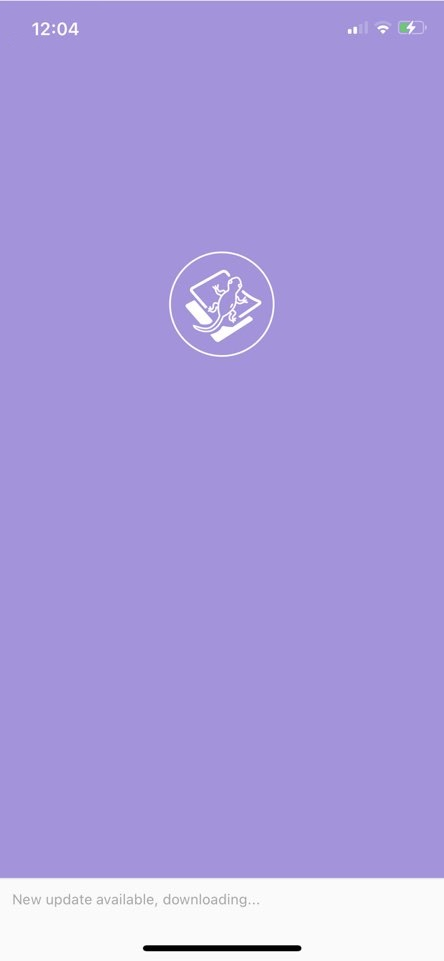
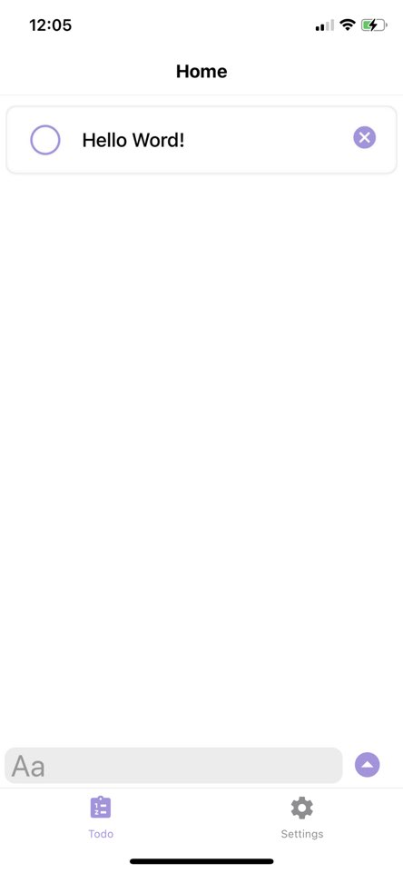
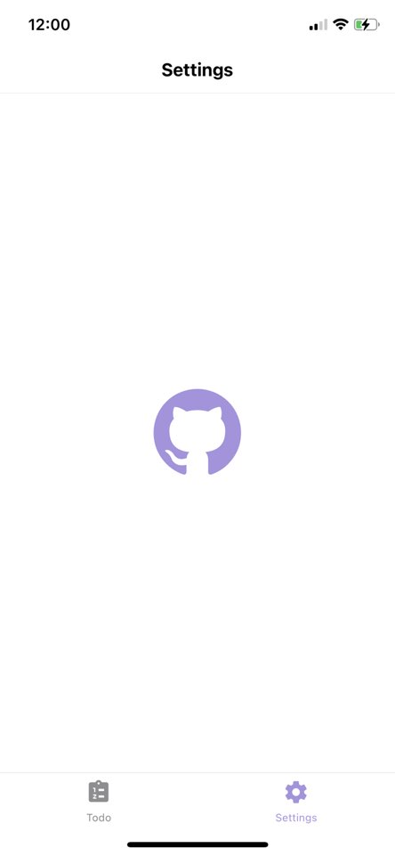

📝 Make your To Do easy

**LIN** is a cross-platform app that manages Todo list.

### How to start LIN app
- https://docs.expo.io/

If you are already experienced with React and JavaScript tooling and want to dive right in and figure things out as you go, this is the quickest way to get started:
```
expo start
```

### How to start API server
- https://golang.org/doc/install

Go `./RestAPI` directory and use the following command to get a list of the others:
```
go run main.go
```

### How to build

If you don't already have Node.js and NPM, go install them. Then, in the folder where you have cloned the repository, install the build dependencies using npm:
```
npm install
```

Then, to build the source, run:
```
npm run build
```

### Notification Server..
> Notification Alert Server

See [here](./Notification-SERVER/README.md)

### How to publish
- https://docs.expo.io/workflow/publishing/

### Example
> Currently, only basic features have been developed.

<p align=center>
    
    &nbsp;&nbsp;&nbsp;&nbsp;&nbsp;
    
</p>

<p align=center>
    
    &nbsp;&nbsp;&nbsp;&nbsp;&nbsp;
    
</p>

> Tested on iPhone 11pro and xs @iOS14.3 @expo2.18.2.1010482

---

<p align=center>© 2021 XENIA101 - Released under GPL License 2.0</p>